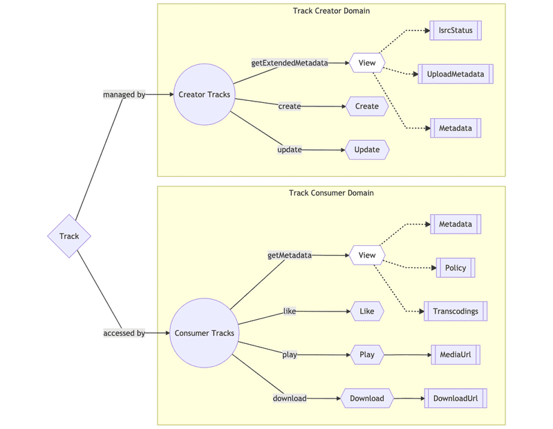

# Arquitetura SoundCloud

## Introdução

> O SoundCloud é uma plataforma global de áudio e música fundada na Suécia que permite que seus usuários carreguem, promovam e transmitam áudio com vários serviços de assinatura.

* Como uma plataforma aberta que conecta diretamente artistas e seus fãs, tornou-se conhecida por seu conteúdo exclusivo e recursos exclusivos conquistando mais de 175 milhões de usuários mensais.
* O site da Sound Cloud usa design adaptável da Web com serviço dinâmico da Web e sua API permite que programas de terceiros carreguem arquivos de áudio ou baixem arquivos com permissão do uploader.
* Isso suporta uma ampla variedade de arquivos, como AIFF, WAV, MP2, MP3 e os transcodifica para mp3 a 128 kbit/s para streaming.
* Ele foi inicialmente construído usando arquitetura monolítica e foi um dos primeiros aplicativos a passar da arquitetura monolítica para a arquitetura de microsserviços.

## Principais Requisitos

1. **Escalabilidade** -> O SoundCloud precisa lidar com uma grande quantidade de uploads, transmissões e interações dos usuários. Portanto, a arquitetura deve ser escalável para suportar o aumento do número de usuários e o crescimento contínuo da plataforma. Para suprir essa demanda, foi adotada uma <mark style="background-color:yellow;">arquitetura distribuída baseada em microsserviços</mark>. Sendo, cada microsserviço responsável por uma função específica. Isso permite que a plataforma dimensione horizontalmente, adicionando mais instâncias dos microsserviços conforme necessário, garantindo a capacidade de lidar com o aumento do tráfego e a demanda dos usuários.
2. **Confiabilidade** -> É fundamental que o SoundCloud seja confiável e esteja disponível para os usuários. O sistema deve lidar com falhas de forma resiliente e garantir uma experiência contínua mesmo em situações adversas. Para alcançar esse objetivo, foi escolhido utilizar a replicação de dados e o balanceamento de carga. Os dados são replicados em vários servidores para garantir a disponibilidade mesmo em caso de falhas. Além disso, a plataforma utiliza o balanceamento de carga para distribuir o tráfego entre os servidores, evitando sobrecargas e garantindo a estabilidade do sistema.
3. **Desempenho** -> Para fornecer streaming de áudio de alta qualidade e permitir uma experiência suave aos usuários, a arquitetura do SoundCloud é projetada para ter um desempenho rápido e eficiente. A plataforma faz uso de técnicas como caching e streaming sob demanda. As músicas mais populares e frequentemente acessadas são armazenadas em cache, reduzindo a latência e permitindo um acesso mais rápido. Além disso, são utilizadas técnicas de compressão de áudio para transmitir músicas com a menor largura de banda possível, garantindo um desempenho otimizado.
4. **Segurança** -> Como plataforma de compartilhamento de conteúdo, o SoundCloud deve proteger os dados dos usuários e garantir a segurança das contas. A arquitetura inclui práticas de segurança, como autenticação de usuário, criptografia de dados e auditorias regulares. São adotadas medidas de autenticação de dois fatores e suporte a autenticação de serviços externos, como o Google e o Facebook, para reforçar a segurança das contas dos usuários. Além disso, são implementados firewalls e sistemas de detecção de intrusões para prevenir ataques e garantir a integridade e a privacidade dos dados dos usuários.

## Arquitetura

### Movendo -se do Monólito para Micro-serviços&#x20;

* O SoundCloud foi criado inicialmente como um único aplicativo monolítico de Ruby no Rails em execução na ressonância magnética, o intérprete oficial de Ruby, e apoiado por Memcached & MySQL.&#x20;
* Com o rápido aumento dos usuários, eles enfrentaram problemas de escala como uma grande rede social com uma potência de distribuição de mídia.&#x20;
* Como solução, eles decidiram avançar em direção à arquitetura de micro-serviços com a ajuda do conceito do "Contexto Delimitado", introduzido por Eric Evans no livro "Domain-Driven Design" e expandido por Martin Fowler em suas palestras e escritos relacionados à arquitetura de software.
* Ao dissociar os serviços de seu aplicativo monolítico de Ruby on Rails chamado _Mothership_, eles moveram com sucesso sua aplicação, do monólito para a arquitetura de micro-serviços.

### Microservices&#x20;

### Introdução

As aplicações da SoundCloud reutilizam sua API pública; o uso de uma camada de serviços RESTful parecia uma decisão sólida, mas cada cliente tem suas próprias necessidades. A SoundCloud está migrando para um modelo onde clientes mantêm suas próprias APIs. Foram necessárias mudanças em arquitetura, tecnologias e processo. Nesta apresentação vamos explorar os desafios enfrentados e decisões tomadas.\

O presente trabalho buscará demonstrar a evolução da arquitetura de serviços na SoundCloud nos últimos anos, bem como abordará os desafios que foram encontrados e as soluções adotadas. Em específico, será abordo a arquitetura Backends for Frontends (BFF), descrevendo seus prós e contras e os principais tópicos relacionados a essa abordagem.

### Backends for Frontends

&#x20;                                           Backends for Frontends no SoundCloud em 2021

<figure><figcaption>
          Figura 1. Arquitetura BFF. 
</figcaption></figure>

O bom

Uma das principais vantagens que a BFF fornece é a autonomia. Ao ter APIs separadas por tipo de cliente, podemos otimizar nossas APIs para o que for conveniente para cada tipo de cliente, sem a necessidade de pontos de sincronização e compromissos difíceis. Outra vantagem dos BFFs é a resiliência. Um deploy ruim pode derrubar um único BFF em uma zona de disponibilidade, mas não deve derrubar toda a plataforma. Isso é adicionado a muitos outros mecanismos de resiliência em vigor. Além disso, alta autonomia e menor risco levam a um alto ritmo de desenvolvimento. Nossos principais BFFs são implantados várias vezes por dia e recebem contribuições de toda a organização de engenharia.

### O ruim

BFFs (Backends for Frontends) têm muitas vantagens, mas também podem causar problemas se não estiverem integrados a uma arquitetura de serviço mais ampla e em arquiteturas de serviço com microserviços muito pequenos, a integração de recursos tende a acabar nos próprios BFFs, se tornando crítico para regras de autorização que só podem ser aplicadas no momento da integração, tornando o modelo inadequado com a adição de mais BFFs.

Na SoundCloud, o problema se manifestou quando as entidades centrais Track e Playlist foram decompostas em múltiplos microserviços que atendiam partes das representações finais montadas em cada um dos BFFs. De repente, a lógica de autorização precisou ser movida para o ponto de integração, que, na época, era o BFF, não sendo preocupante no início, mas à medida que a lógica cresceu em complexidade e o número de BFFs aumentou, causou muitos problemas.

### O feio

Para operar vários BFFs de forma eficaz, é necessário um conjunto de capacidades em toda a plataforma que, em sua ausência, podem levar à proliferação desnecessária de BFFs. Isso inclui a necessidade de direitos de aplicativo para restringir o acesso a determinados aplicativos e integrações de terceiros a pontos de extremidade específicos. É importante estabelecer uma estratégia para decidir quantos BFFs são muitos e quando criar um versus quando reutilizar um existente, levando em consideração a troca entre autonomia e manutenção adicional e sobrecarga operacional.

Também é importante reconhecer que os BFFs estão na interseção de dois mundos, e a ideia de plena autonomia para os desenvolvedores do cliente é uma ilusão, sendo necessária uma extensa colaboração entre engenheiros de front-end e back-end para garantir designs de API otimizados que sejam convenientes para os desenvolvedores do cliente usar, além de serem otimizados para ambientes distribuídos e suas complexidades. É preciso ter cuidado ao empurrar a lógica complexa do lado do cliente para o BFF, pois isso pode levar a problemas como timeouts, limites restritivos para o tamanho da coleção e tempestades que podem derrubar todo o sistema.

**Serviços de Valor Adicionado**

Value-Added Services (VAS) significa "Serviços de Valor Adicionado". Trata-se de serviços que oferecem valor adicional aos usuários, além do serviço básico oferecido por uma empresa. Esses serviços geralmente são opcionais e podem incluir recursos como suporte técnico especializado, personalização, conteúdo exclusivo, recursos de segurança adicionais e muito mais.&#x20;

.png>)

**Edge:** Esta camada fornece capacidades de gateway de API e é onde nossos BFFs (backends for frontends) vivem. Os BFFs são APIs dedicadas publicadas e mantidas que são adaptadas às necessidades específicas do cliente.

**Value Added:** Serviços nesta camada consomem dados de outros serviços e os processam de alguma maneira para construir experiências ricas para os usuários.

**Foundation:** Este é um serviço de baixo nível que fornece os blocos de construção em torno de um domínio.

Também é importante entender os blocos de construção que se unem nos Serviços com Valor Agregado.&#x20;

.png>)\
**Domain**: Uma preocupação do usuário ou do negócio que pode ser usada para definir limites/escopo em torno das integrações de serviço.

**Entity**: Uma entidade é um objeto que possui um identificador independente e um ciclo de vida.&#x20;

**Value Objects**:  Os objetos de valor contêm metadados relacionados a uma determinada entidade; eles também estão ligados ao ciclo de vida da entidade.

&#x20;**Aggregate**: Um agregado é uma coleção de uma ou mais entidades relacionadas. Um agregado possui uma entidade raiz chamada raiz do agregado. Os agregados também podem conter referências a outras entidades, mas não aos metadados da entidade referenciada. Então, cabe aos serviços consumidores chamar outros serviços para sintetizar as referências da entidade.

_Value-Added Services (VAS)_ são serviços de negócios responsáveis por retornar uma entidade e seus objetos de valor associados (ou seja, um agregado) ao chamador. É importante notar que um VAS não é responsável por sintetizar metadados para quaisquer entidades associadas. Isso permite uma separação clara de responsabilidades, juntamente com um ponto centralizado onde metadados e regras de autorização para uma determinada entidade podem ser definidos. Um VAS pode orquestrar chamadas a esses serviços para sintetizar e autorizar agregados a serem retornados ao BFF.

Vamos aplicar esses conceitos a exemplos reais da SoundCloud. Uma entidade de exemplo é uma faixa, que tem objetos de valor associados, como metadados, transcodificações e políticas de autorização para determinar a visibilidade. Uma faixa também está conectada a um usuário proprietário, mas como esta é outra entidade, ela contém apenas o ID do usuário como referência. Se um serviço consumidor tiver um ID de faixa que deseja resolver, ele chamará o VAS de Faixas, que se encarrega de garantir que a faixa seja visível e, em seguida, retorna o agregado de faixa correspondente.

Anteriormente, se um usuário final quisesse buscar uma faixa, a solicitação seria enviada ao BFF. Caberia então ao BFF determinar se o usuário da sessão tinha autorização para ver essa faixa e, se sim, sintetizar a representação externa da faixa para retornar ao usuário. Isso envolveria chamadas a vários serviços Foundation que são individualmente responsáveis por retornar informações de autorização e metadados de faixa.

Com a introdução do serviço Tracks VAS, o padrão anterior de chamadas duplicadas aos serviços Foundation nos BFFs foi alterado. Agora, todo o processo de síntese de agregados de faixas para os BFFs é feito pelo serviço Tracks, que também lida com a visibilidade e autorização específicas do contexto das faixas. O BFF agora é responsável por mapear os agregados internos de faixas para representações externas para os clientes consumirem. Isso remove a necessidade de orquestrar chamadas aos serviços Foundation e garante que a autorização seja tratada corretamente.

.png>)

**Evolução do VAS no SoundCloud**

No artigo, é explicado como a arquitetura de Value-Added Services (VAS) foi introduzida na SoundCloud para gerenciar entidades e objetos de valor. Em 2019, a equipe de desenvolvimento da SoundCloud implementou um serviço Tracks usando o conceito de VAS, o que ajudou a validar o modelo para outras entidades. Em 2020, a equipe começou a refatorar a API pública, e os endpoints relacionados a faixas foram facilmente migrados para usar o serviço Tracks VAS. No entanto, a equipe precisou decidir se duplicaria a lógica de autorização e busca de listas de reprodução de outros BFFs para a API pública ou criaria um novo serviço de VAS de listas de reprodução. Eles optaram pela última opção, o que exigiu refatorar os outros BFFs para usar o serviço de VAS de listas de reprodução. O gráfico a seguir ilustra o processo de migração:

.png>)

O esquema anterior das APIs da SoundCloud mostrava que elas se conectavam diretamente ao Mothership e à Playlist Authorization, o que gerava dois problemas principais: duplicação de lógica nos BFFs e autorização frágil. O gráfico a seguir mostra nossa solução:

.png>)

Com esta arquitetura, toda a lógica é centralizada no Playlist VAS.

Este projeto foi dividido nos seguintes passos:

**Extracting the logic:** Extração da lógica dos BFFs e criação de um novo serviço centralizado de playlists (Playlist VAS). A equipe investigou e documentou todas as diferentes implementações da lógica de playlists em seus principais serviços para desenvolver a lógica básica de busca de playlists. Depois de coletar feedback da organização, a equipe implementou o serviço.

**Automatic tests:** Testes automáticos para garantir que a lógica centralizada corresponde aos serviços refatorados. Foram adicionados testes unitários para garantir que todos os possíveis cenários de busca e autorização de playlists fossem cobertos. Também foram adicionados testes de integração para garantir que os formatos de resposta com os clientes não fossem quebrados e que as integrações com serviços dependentes funcionassem corretamente.

**Migrating the BFFs:** Usar o Playlists VAS. Este passo pode parecer fácil, mas na verdade levou mais tempo do que implementar o serviço em si. Tivemos que migrar mais de 50 endpoints relacionados a playlists dos BFFs principais. Fizemos isso ponto a ponto e comparando cuidadosamente as respostas das duas implementações, pois não queríamos quebrar nada nos clientes dos BFFs.

As vantagens da implementação de um serviço de acesso de valor (VAS) para a lógica de resolução de playlists. O VAS centraliza a lógica de negócios e simplifica o desenvolvimento de recursos cruzados em diferentes plataformas. A centralização da lógica de autorização em um único serviço ajuda a evitar inconsistências e vulnerabilidades. A comunicação entre serviços VAS é possível sem dependências circulares. No entanto, a criação de um novo serviço tem custos de manutenção e infraestrutura e pode aumentar as latências da rede. Uma abordagem alternativa seria ter o VAS como uma biblioteca externa, mas isso apresenta riscos de complexidade e versão. O uso do Twinagle simplifica a integração e a manutenção de serviços.

### Growing Aggregates

.png>)

Um VAS pode ser imaginado como um grande "fanout" com lógica de autorização, onde o serviço busca estados de entidades associadas a partir de serviços Foundation correspondentes, e então aplica regras de autorização de negócios. No entanto, o tamanho do fanout pode ser um desafio à medida que os agregados crescem.

Para resolver esse problema, foi utilizado respostas parciais, permitindo que os consumidores da API informem ao produtor qual parte da resposta eles vão consumir, especificando um FieldMask na solicitação. Isso permite que os endpoints centralizados de agregação sejam personalizados para atender às necessidades específicas dos BFFs. Usamos Twinagle, uma IDL protobuf baseada no protocolo Twirp, e as definições protobuf fornecem construção e validação seguras por meio de FieldMaskUtils.

.png>)

Uma desvantagem das máscaras de campos para respostas parciais é um acoplamento mais rígido entre a topologia dos micros serviços e os esquemas de agregados (IDLs). As máscaras de campo podem ser definidas de acordo com as dependências de serviço e as chamadas de rede para reduzir o número de solicitações necessárias para produzir uma representação do BFF. Na SoundCloud, o foco está mais na redução da complexidade na camada de borda (especificamente nos BFFs). Embora as máscaras de campos possam otimizar as chamadas de rede também, não é necessário ter uma correspondência direta entre as máscaras de campos e as chamadas de rede.

**Commands**\
\
Enquanto estendíamos o escopo do VAS para servir agregados das nossas entidades, identificamos que poderíamos também estender o VAS para ações que mutam o estado da entidade principal, mas ao mesmo tempo exigem lógica de autorização. Para centralizar ainda mais as entidades principais, estendemos nosso VAS com comandos. Alguns exemplos dessas operações de comando no domínio de Faixas incluem "baixar uma faixa", "curtir uma faixa" e "repostar uma faixa".

Uma vez que é uma operação que vive no VAS, também tem a vantagem de reduzir a lógica complexa nos BFFs (no caso de tal lógica ter sido duplicada lá) e melhorar a confiabilidade em termos de lógica de acesso daqueles comandos que exigem acesso concedido a uma determinada faixa. Podemos ilustrar o caso de curtir uma faixa na VAS de faixas:

.png>)

Como podemos ver no gráfico, os BFFs enviariam uma solicitação para o serviço de Tracks para executar uma operação de faixa. O serviço que geralmente registra operações "curtir" fica no serviço Likes. Este serviço não está ciente de autorizações de faixas; ele apenas cria/exclui links entre faixas/playlists e usuários. É por isso que precisamos verificar primeiro se o usuário que deseja curtir uma faixa tem acesso a ela. O melhor lugar para realizar essa lógica de forma centralizada é no Tracks VAS.

#### Separation of Queries and Commands

Para resumir, a interface do VAS consiste em duas partes: um endpoint para servir seu agregado de acordo com as necessidades do BFF, chamado de queries; e endpoints que expõem operações de entidade central, chamadas de commands. Essa separação é a ideia central por trás do padrão CQRS e fornece benefícios práticos, como a possibilidade de fornecer serviços ou armazenamentos separados para operações de leitura e gravação. Essa abstração reduz a complexidade e melhora a consistência nos BFFs.

### Beyond Core Entities: Domain Gateways

Podemos notar a necessidade de criar uma abordagem escalável para gerenciar entidades em diferentes domínios de negócios. Em vez de implementar tudo o que pode ser feito com uma entidade (como uma música), em todos os domínios, é recomendado identificar os diferentes domínios de negócios que precisam usar a mesma entidade e criar um Gateway de Domínio para cada um deles. O Gateway de Domínio é uma implementação de um Serviço de Valor Agregado (VAS) ligado a um domínio específico. Cada Gateway pode ser mantido por equipes diferentes e representar visões diferentes sobre a mesma entidade, utilizando a mesma camada fundamental de serviços. A abordagem de Gateway de Domínio oferece escalabilidade, autonomia e estabilidade para cada um dos domínios.

