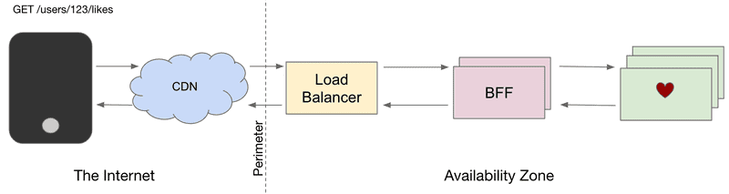

# Arquitetura SoundCloud

## Introdução

> O SoundCloud é uma plataforma global de áudio e música fundada na Suécia que permite que seus usuários carreguem, promovam e transmitam áudio com vários serviços de assinatura.

* Como uma plataforma aberta que conecta diretamente artistas e seus fãs, tornou-se conhecida por seu conteúdo exclusivo e recursos exclusivos conquistando mais de 175 milhões de usuários mensais.
* O site da Sound Cloud usa design adaptável da Web com serviço dinâmico da Web e sua API permite que programas de terceiros carreguem arquivos de áudio ou baixem arquivos com permissão do uploader.
* Isso suporta uma ampla variedade de arquivos, como AIFF, WAV, MP2, MP3 e os transcodifica para mp3 a 128 kbit/s para streaming.
* Ele foi inicialmente construído usando arquitetura monolítica e foi um dos primeiros aplicativos a passar da arquitetura monolítica para a arquitetura de microsserviços.

## Principais Requisitos

1. **Escalabilidade** -> O SoundCloud precisa lidar com uma grande quantidade de uploads, transmissões e interações dos usuários. Portanto, a arquitetura deve ser escalável para suportar o aumento do número de usuários e o crescimento contínuo da plataforma. Para suprir essa demanda, foi adotada uma <mark style="background-color:yellow;">arquitetura distribuída baseada em microsserviços</mark>. Sendo, cada microsserviço responsável por uma função específica. Isso permite que a plataforma dimensione horizontalmente, adicionando mais instâncias dos microsserviços conforme necessário, garantindo a capacidade de lidar com o aumento do tráfego e a demanda dos usuários.
2. **Confiabilidade** -> É fundamental que o SoundCloud seja confiável e esteja disponível para os usuários. O sistema deve lidar com falhas de forma resiliente e garantir uma experiência contínua mesmo em situações adversas. Para alcançar esse objetivo, foi escolhido utilizar a replicação de dados e o balanceamento de carga. Os dados são replicados em vários servidores para garantir a disponibilidade mesmo em caso de falhas. Além disso, a plataforma utiliza o balanceamento de carga para distribuir o tráfego entre os servidores, evitando sobrecargas e garantindo a estabilidade do sistema.
3. **Desempenho** -> Para fornecer streaming de áudio de alta qualidade e permitir uma experiência suave aos usuários, a arquitetura do SoundCloud é projetada para ter um desempenho rápido e eficiente. A plataforma faz uso de técnicas como caching e streaming sob demanda. As músicas mais populares e frequentemente acessadas são armazenadas em cache, reduzindo a latência e permitindo um acesso mais rápido. Além disso, são utilizadas técnicas de compressão de áudio para transmitir músicas com a menor largura de banda possível, garantindo um desempenho otimizado.
4. **Segurança** -> Como plataforma de compartilhamento de conteúdo, o SoundCloud deve proteger os dados dos usuários e garantir a segurança das contas. A arquitetura inclui práticas de segurança, como autenticação de usuário, criptografia de dados e auditorias regulares. São adotadas medidas de autenticação de dois fatores e suporte a autenticação de serviços externos, como o Google e o Facebook, para reforçar a segurança das contas dos usuários. Além disso, são implementados firewalls e sistemas de detecção de intrusões para prevenir ataques e garantir a integridade e a privacidade dos dados dos usuários.

## Arquitetura

### Movendo -se do Monólito para Micro-serviços&#x20;

* O SoundCloud foi criado inicialmente como um único aplicativo monolítico de Ruby no Rails em execução na ressonância magnética, o intérprete oficial de Ruby, e apoiado por Memcached & MySQL.&#x20;
* Com o rápido aumento dos usuários, eles enfrentaram problemas de escala como uma grande rede social com uma potência de distribuição de mídia.&#x20;
* Como solução, eles decidiram avançar em direção à arquitetura de micro-serviços com a ajuda do conceito do "Contexto Delimitado", introduzido por Eric Evans no livro "Domain-Driven Design" e expandido por Martin Fowler em suas palestras e escritos relacionados à arquitetura de software.
* Ao dissociar os serviços de seu aplicativo monolítico de Ruby on Rails chamado _Mothership_, eles moveram com sucesso sua aplicação, do monólito para a arquitetura de micro-serviços.

### Microservices&#x20;

### Introdução

As aplicações da SoundCloud reutilizam sua API pública; o uso de uma camada de serviços RESTful parecia uma decisão sólida, mas cada cliente tem suas próprias necessidades. A SoundCloud está migrando para um modelo onde clientes mantêm suas próprias APIs. Foram necessárias mudanças em arquitetura, tecnologias e processo. Nesta apresentação vamos explorar os desafios enfrentados e decisões tomadas.\

O presente trabalho buscará demonstrar a evolução da arquitetura de serviços na SoundCloud nos últimos anos, bem como abordará os desafios que foram encontrados e as soluções adotadas. Em específico, será abordo a arquitetura Backends for Frontends (BFF), descrevendo seus prós e contras e os principais tópicos relacionados a essa abordagem.

### Backends for Frontends

&#x20;                                           Backends for Frontends no SoundCloud em 2021

<figure><figcaption>
          Figura 1. Arquitetura BFF. 
</figcaption></figure>

O bom

Uma das principais vantagens que a BFF fornece é a autonomia. Ao ter APIs separadas por tipo de cliente, podemos otimizar nossas APIs para o que for conveniente para cada tipo de cliente, sem a necessidade de pontos de sincronização e compromissos difíceis. Outra vantagem dos BFFs é a resiliência. Um deploy ruim pode derrubar um único BFF em uma zona de disponibilidade, mas não deve derrubar toda a plataforma. Isso é adicionado a muitos outros mecanismos de resiliência em vigor. Além disso, alta autonomia e menor risco levam a um alto ritmo de desenvolvimento. Nossos principais BFFs são implantados várias vezes por dia e recebem contribuições de toda a organização de engenharia.

### O ruim

BFFs (Backends for Frontends) têm muitas vantagens, mas também podem causar problemas se não estiverem integrados a uma arquitetura de serviço mais ampla e em arquiteturas de serviço com microserviços muito pequenos, a integração de recursos tende a acabar nos próprios BFFs, se tornando crítico para regras de autorização que só podem ser aplicadas no momento da integração, tornando o modelo inadequado com a adição de mais BFFs.

Na SoundCloud, o problema se manifestou quando as entidades centrais Track e Playlist foram decompostas em múltiplos microserviços que atendiam partes das representações finais montadas em cada um dos BFFs. De repente, a lógica de autorização precisou ser movida para o ponto de integração, que, na época, era o BFF, não sendo preocupante no início, mas à medida que a lógica cresceu em complexidade e o número de BFFs aumentou, causou muitos problemas.

### O feio

Para operar vários BFFs de forma eficaz, é necessário um conjunto de capacidades em toda a plataforma que, em sua ausência, podem levar à proliferação desnecessária de BFFs. Isso inclui a necessidade de direitos de aplicativo para restringir o acesso a determinados aplicativos e integrações de terceiros a pontos de extremidade específicos. É importante estabelecer uma estratégia para decidir quantos BFFs são muitos e quando criar um versus quando reutilizar um existente, levando em consideração a troca entre autonomia e manutenção adicional e sobrecarga operacional.

Também é importante reconhecer que os BFFs estão na interseção de dois mundos, e a ideia de plena autonomia para os desenvolvedores do cliente é uma ilusão, sendo necessária uma extensa colaboração entre engenheiros de front-end e back-end para garantir designs de API otimizados que sejam convenientes para os desenvolvedores do cliente usar, além de serem otimizados para ambientes distribuídos e suas complexidades. É preciso ter cuidado ao empurrar a lógica complexa do lado do cliente para o BFF, pois isso pode levar a problemas como timeouts, limites restritivos para o tamanho da coleção e tempestades que podem derrubar todo o sistema.\
\
\
