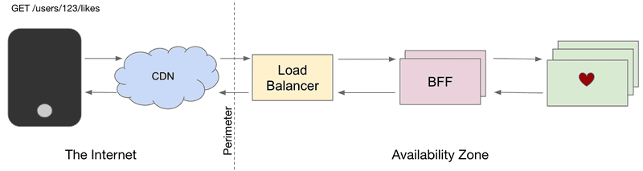

# BFF (Back-end for Front-end)

&#x20;                                           Backends for Frontends no SoundCloud em 2021

<figure><figcaption>
          Figura 1. Arquitetura BFF. 
</figcaption></figure>

#### Vantangens

Uma das principais vantagens que a BFF fornece é a autonomia. Ao ter APIs separadas por tipo de cliente, podemos otimizar nossas APIs para o que for conveniente para cada tipo de cliente, sem a necessidade de pontos de sincronização e compromissos difíceis. Outra vantagem dos BFFs é a resiliência. Um deploy ruim pode derrubar um único BFF em uma zona de disponibilidade, mas não deve derrubar toda a plataforma. Isso é adicionado a muitos outros mecanismos de resiliência em vigor. Além disso, alta autonomia e menor risco levam a um alto ritmo de desenvolvimento. Nossos principais BFFs são implantados várias vezes por dia e recebem contribuições de toda a organização de engenharia.

#### Desvantagens

BFFs (Backends for Frontends) têm muitas vantagens, mas também podem causar problemas se não estiverem integrados a uma arquitetura de serviço mais ampla e em arquiteturas de serviço com microsserviços muito pequenos, a integração de recursos tende a acabar nos próprios BFFs, se tornando crítico para regras de autorização que só podem ser aplicadas no momento da integração, tornando o modelo inadequado com a adição de mais BFFs.

Na SoundCloud, o problema se manifestou quando as entidades centrais Track e Playlist foram decompostas em múltiplos microsserviços que atendiam partes das representações finais montadas em cada um dos BFFs. De repente, a lógica de autorização precisou ser movida para o ponto de integração, que, na época, era o BFF, não sendo preocupante no início, mas à medida que a lógica cresceu em complexidade e o número de BFFs aumentou, causou muitos problemas.

#### Complexidade

Para operar vários BFFs de forma eficaz, é necessário um conjunto de capacidades em toda a plataforma que, em sua ausência, podem levar à proliferação desnecessária de BFFs. Isso inclui a necessidade de direitos de aplicativo para restringir o acesso a determinados aplicativos e integrações de terceiros a pontos de extremidade específicos. É importante estabelecer uma estratégia para decidir quantos BFFs são muitos e quando criar um versus quando reutilizar um existente, levando em consideração a troca entre autonomia e manutenção adicional e sobrecarga operacional.

Também é importante reconhecer que os BFFs estão na interseção de dois mundos, e a ideia de plena autonomia para os desenvolvedores do cliente é uma ilusão, sendo necessária uma extensa colaboração entre engenheiros de front-end e back-end para garantir designs de API otimizados que sejam convenientes para os desenvolvedores do cliente usar, além de serem otimizados para ambientes distribuídos e suas complexidades. É preciso ter cuidado ao empurrar a lógica complexa do lado do cliente para o BFF, pois isso pode levar a problemas como timeouts, limites restritivos para o tamanho da coleção e tempestades que podem derrubar todo o sistema.
