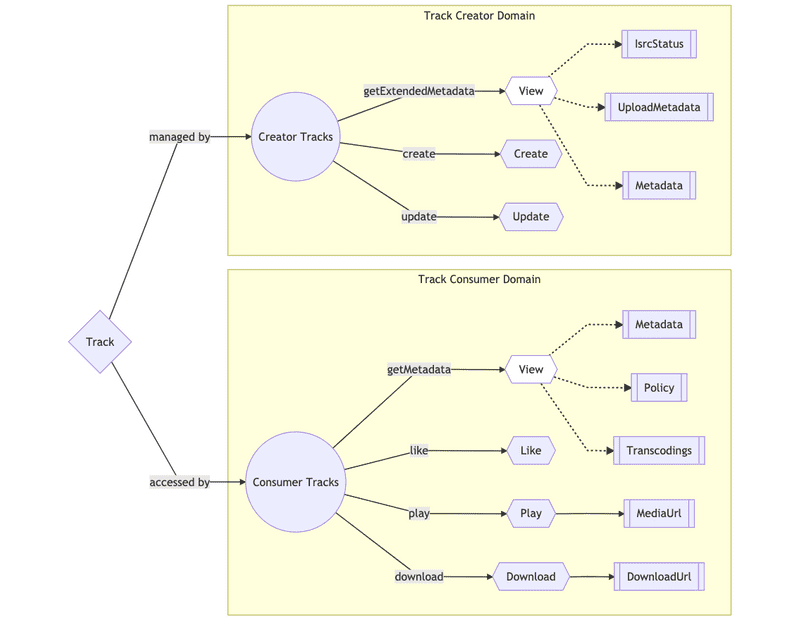

# VAS (Value-Added Services)

### Growing Aggregates

<figure><figcaption></figcaption></figure>

Um VAS pode ser imaginado como um grande "fanout" com lógica de autorização, onde o serviço busca estados de entidades associadas a partir de serviços Foundation correspondentes, e então aplica regras de autorização de negócios. No entanto, o tamanho do fanout pode ser um desafio à medida que os agregados crescem.

Para resolver esse problema, foi utilizado respostas parciais, permitindo que os consumidores da API informem ao produtor qual parte da resposta eles vão consumir, especificando um FieldMask na solicitação. Isso permite que os endpoints centralizados de agregação sejam personalizados para atender às necessidades específicas dos BFFs. Usamos Twinagle, uma IDL protobuf baseada no protocolo Twirp, e as definições protobuf fornecem construção e validação seguras por meio de FieldMaskUtils.

<figure><figcaption></figcaption></figure>

Uma desvantagem das máscaras de campos para respostas parciais é um acoplamento mais rígido entre a topologia dos micros serviços e os esquemas de agregados (IDLs). As máscaras de campo podem ser definidas de acordo com as dependências de serviço e as chamadas de rede para reduzir o número de solicitações necessárias para produzir uma representação do BFF. Na SoundCloud, o foco está mais na redução da complexidade na camada de borda (especificamente nos BFFs). Embora as máscaras de campos possam otimizar as chamadas de rede também, não é necessário ter uma correspondência direta entre as máscaras de campos e as chamadas de rede.

**Commands**\
\
Enquanto estendíamos o escopo do VAS para servir agregados das nossas entidades, identificamos que poderíamos também estender o VAS para ações que mutam o estado da entidade principal, mas ao mesmo tempo exigem lógica de autorização. Para centralizar ainda mais as entidades principais, estendemos nosso VAS com comandos. Alguns exemplos dessas operações de comando no domínio de Faixas incluem "baixar uma faixa", "curtir uma faixa" e "repostar uma faixa".

Uma vez que é uma operação que vive no VAS, também tem a vantagem de reduzir a lógica complexa nos BFFs (no caso de tal lógica ter sido duplicada lá) e melhorar a confiabilidade em termos de lógica de acesso daqueles comandos que exigem acesso concedido a uma determinada faixa. Podemos ilustrar o caso de curtir uma faixa na VAS de faixas:

<figure><figcaption></figcaption></figure>

Como podemos ver no gráfico, os BFFs enviariam uma solicitação para o serviço de Tracks para executar uma operação de faixa. O serviço que geralmente registra operações "curtir" fica no serviço Likes. Este serviço não está ciente de autorizações de faixas; ele apenas cria/exclui links entre faixas/playlists e usuários. É por isso que precisamos verificar primeiro se o usuário que deseja curtir uma faixa tem acesso a ela. O melhor lugar para realizar essa lógica de forma centralizada é no Tracks VAS.

#### Separation of Queries and Commands

Para resumir, a interface do VAS consiste em duas partes: um endpoint para servir seu agregado de acordo com as necessidades do BFF, chamado de queries; e endpoints que expõem operações de entidade central, chamadas de commands. Essa separação é a ideia central por trás do padrão CQRS e fornece benefícios práticos, como a possibilidade de fornecer serviços ou armazenamentos separados para operações de leitura e gravação. Essa abstração reduz a complexidade e melhora a consistência nos BFFs.

### Beyond Core Entities: Domain Gateways

Podemos notar a necessidade de criar uma abordagem escalável para gerenciar entidades em diferentes domínios de negócios. Em vez de implementar tudo o que pode ser feito com uma entidade (como uma música), em todos os domínios, é recomendado identificar os diferentes domínios de negócios que precisam usar a mesma entidade e criar um Gateway de Domínio para cada um deles. O Gateway de Domínio é uma implementação de um Serviço de Valor Agregado (VAS) ligado a um domínio específico. Cada Gateway pode ser mantido por equipes diferentes e representar visões diferentes sobre a mesma entidade, utilizando a mesma camada fundamental de serviços. A abordagem de Gateway de Domínio oferece escalabilidade, autonomia e estabilidade para cada um dos domínios.

<figure><figcaption></figcaption></figure>
